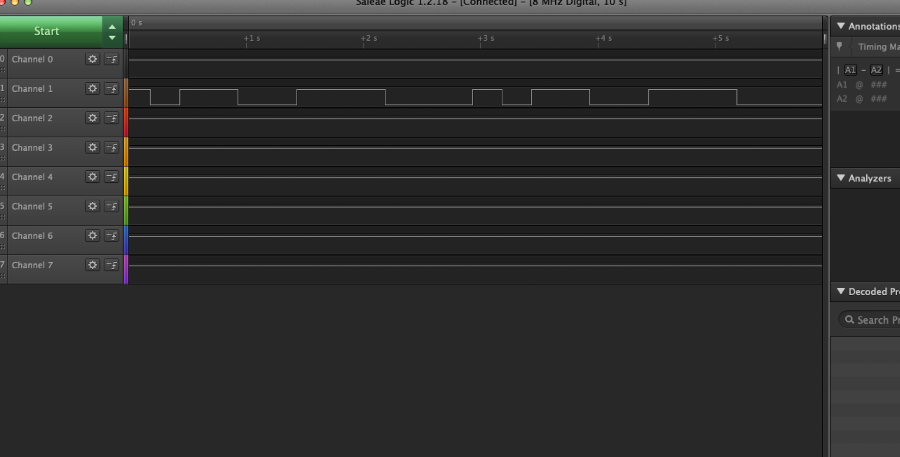
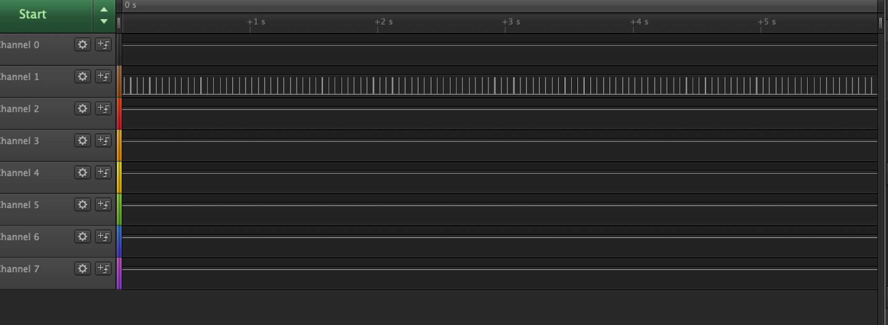
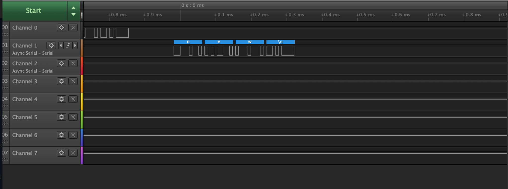
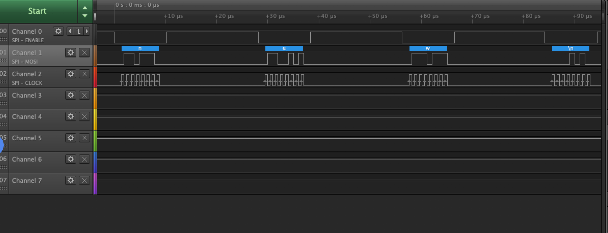

Name: Anika Singh

EID: as93479

Team Number: Team 10 

## Questions

1. Why does your program need a setup and a loop?

    Setup and loop are both functions, setup will initialize and the loop function will continue looping as it takes in the inputs

2. What is the downside to putting all your code in a loop?

    By putting all the code in a loop you can't choose which functions to call and will have to continuously use all the different functions. This also reduces the clarity of the code and is harder to organize.

3. Why does your code need to be compiled?

    The code needs to be compiled into machine code for the computer

4. When lowering the frequency in procedure A, step 4, what is going wrong? Brainstorm some solutions. Dimmers exist in the real world. What is their solution?

    By lowering the frequency, the LED will start blinking instead of dimming because it doesn't allow time for the LED to go low and high so it is noticable from our eyes. By increasing the frequency will give a more dimming effect.

5. Why do you need to connect the logic analyzer ground to the ESP32 ground?

    So that there is a difference in voltage and the circuit will get completed.

6. What is the difference between synchronous and asynchronous communication?

    In synchronous communication, everything runs at the same speed as it is controlled by the clock. However, in asynchronous communication, it will run in different speeds and is controlled by an external signal.

7. Profile of UART: Sent X bytes in Y time 

    4 bytes in 0.932 ms

8. Profile of SPI: Sent X bytes in Y time

    4 bytes in 0.543 ms

9. Why is SPI so much faster than UART?

    SPI is faster than UART because SPI doesn't have synchronization so can keep sending data.
    
10. list one pro and one con of UART

    One pro is that there is no clock, however it is slower

11. list one pro and one con of SPI

    One pro is that it is fast, however it takes fewer devices since it has fewer pins.

12. list one pro and one con of I2C

    One pro is that it can support multiple different devices, however it needs more space.

13. Why does I2C need external resistors to work?

    Since the I2C has many devices attached, the resistors allow for the I2C to restore the voltages of non used devices

## Screenshots

Procedure A, step 1:

Procedure A, step 4:

Procedure B, UART:

Procedure B, SPI:

